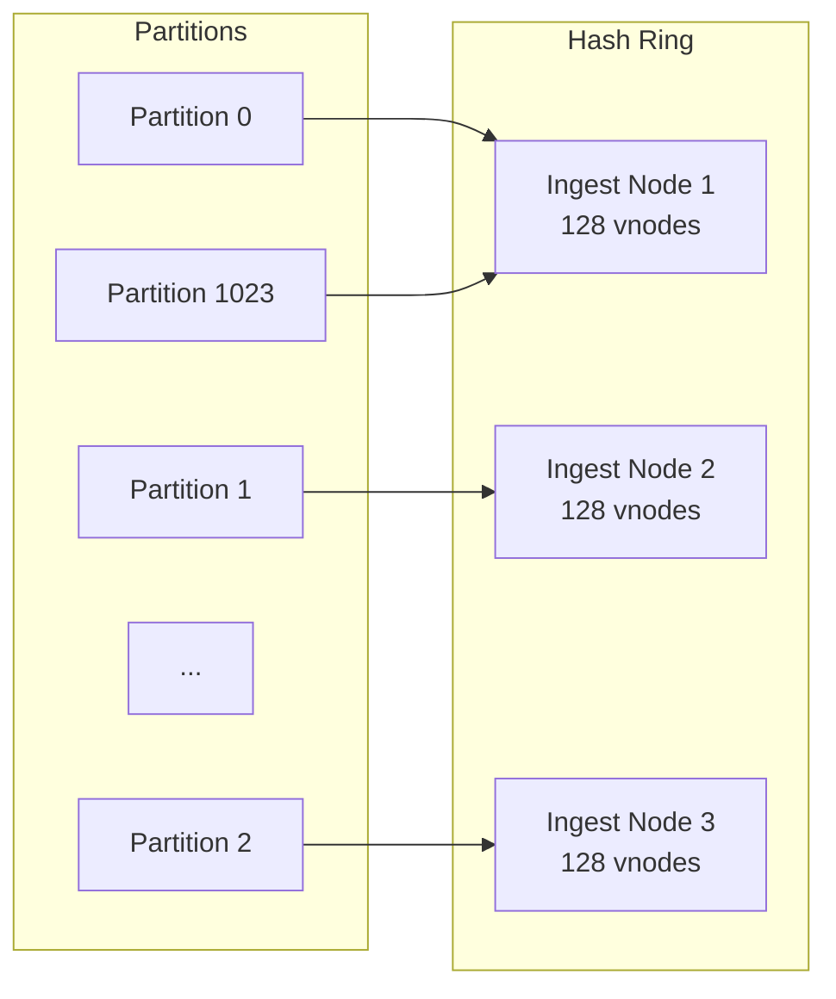
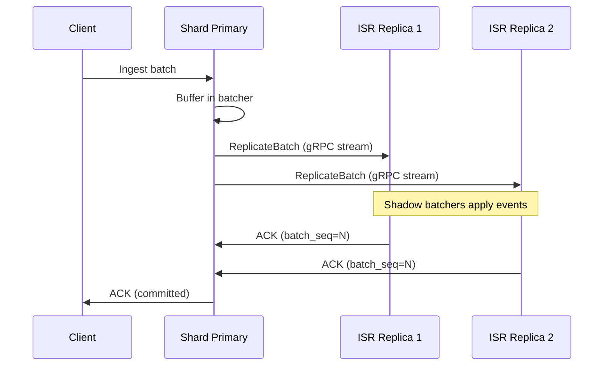

# Distributed Architecture

LynxDB scales from a single process to a 1000+ node cluster using the same binary. The distributed architecture is based on a shared-storage model where S3 is the source of truth for segment data, making compute nodes effectively stateless.

## Cluster Topology

```
┌──────────────────┐    ┌──────────────┐    ┌──────────────┐
│   Meta Nodes     │    │ Ingest Nodes │    │ Query Nodes  │
│   (3-5, Raft)    │    │ (N, stateless│    │ (M, stateless│
│                  │    │  + batcher)  │    │  + cache)    │
│ - Shard map      │    │ - Batcher    │    │ - Scatter-   │
│ - Node registry  │    │ - Memtable   │    │   gather     │
│ - Leases         │    │ - Flush→S3   │    │ - Partial    │
│ - Field catalog  │    │ - Replicate  │    │   merge      │
│ - Source registry│    │              │    │              │
│ - Alert assign   │    │              │    │              │
│ - View registry  │    │              │    │              │
└──────┬───────────┘    └──────┬───────┘    └──────┬───────┘
       │                       │                   │
       └───────────────────────┼───────────────────┘
                         ┌─────┴─────┐
                         │  S3/MinIO │
                         │ (source   │
                         │  of truth)│
                         └───────────┘
```

## Node Roles

The cluster has three roles. In small clusters (< 10 nodes), every node runs all three roles. At scale, you split them for independent scaling.

### Meta Nodes (3-5)

Meta nodes manage cluster coordination and metadata:

- **Raft consensus**: Meta nodes form a Raft group (using `hashicorp/raft`) to maintain a consistent, replicated state machine.
- **Shard map**: The shard map records which ingest node owns which shard (partition). Updated atomically via Raft. Each assignment carries a primary, replicas, lifecycle state (`active`/`draining`/`migrating`/`splitting`), and an epoch counter.
- **Node registry**: Tracks the set of live nodes, their roles, health state (`alive`/`suspect`/`dead`), and resource utilization (CPU, memory, disk, ingest rate, active queries).
- **Leader leases**: Shard primaries hold renewable leases to prevent split-brain writes. The meta leader grants leases via Raft; an expired lease means the primary must stop writing.
- **Failure detection**: Detects unresponsive nodes using heartbeat timeouts and transitions them through `Alive → Suspect → Dead`.
- **Distributed subsystems**: The Raft FSM also stores the global field catalog, source registry, alert assignments, and materialized view definitions (see [Distributed Subsystems](#distributed-subsystems) below).

Meta nodes are lightweight. 3 nodes provide fault tolerance for 1 failure; 5 nodes tolerate 2 failures. Meta nodes do not store or query log data.

### Ingest Nodes (N)

Ingest nodes handle the write path:

1. Receive ingest requests (via the REST API or compatibility endpoints).
2. Route events to the correct shard based on the [two-level sharding scheme](#sharding).
3. Buffer events in the batcher (batch-oriented ingestion pipeline, not WAL-based in cluster mode).
4. Insert events into the sharded memtable.
5. When the memtable flush threshold is reached, flush to a `.lsg` segment.
6. Upload the segment to S3.
7. Replicate batches to ISR peers via gRPC streaming (see [Replication](#replication)).

Ingest nodes are **stateless after flush**. If an ingest node fails, its replicated batches can be recovered from ISR peers, and the shard is reassigned to another ingest node within ~25 seconds.

### Query Nodes (M)

Query nodes handle the read path:

1. Receive query requests via the REST API.
2. Parse and optimize the SPL2 query.
3. Determine which shards (and therefore which segments) are relevant using time range pruning and shard key matching.
4. Scatter the query to the appropriate nodes via gRPC (or read segments directly from S3/cache).
5. Merge partial results from all shards.
6. Return the final result to the client (with partial result metadata when some shards fail).

Query nodes maintain a **local segment cache** to avoid repeatedly downloading segments from S3. The cache uses LRU eviction with a configurable size limit. Query nodes also receive piggybacked field catalog and source registry updates via the shard map watch stream.

## Sharding

Data is partitioned across ingest nodes using a **two-level sharding scheme**: time bucketing followed by hash partitioning.

### Two-Level Scheme

```
┌─────────────────────────────────────────────────────────┐
│ Level 1 (Time):  ts.Truncate(TimeBucketSize)            │
│                  Default: 24h → one bucket per day       │
│                  Configurable: 1h, 6h, 24h               │
│                                                          │
│ Level 2 (Hash):  xxhash64(source + "\x00" + host)       │
│                  mod VirtualPartitionCount (default 1024) │
│                                                          │
│ ShardID:  "<index>/t<date>/p<partition>"                  │
│           e.g., "main/t2026-03-09/p42"                   │
└─────────────────────────────────────────────────────────┘
```

**Level 1 (Time bucketing)**: The event timestamp is truncated to the nearest `TimeBucketSize` boundary (configurable: 1h, 6h, or 24h; default 24h). This ensures that time-range queries can skip entire time buckets that fall outside the query window.

**Level 2 (Hash partitioning)**: Within each time bucket, `xxhash64(source + "\x00" + host)` is computed and mapped to one of `VirtualPartitionCount` partitions (default 1024). Using xxhash64 provides excellent distribution and is already used in bloom filters and dedup. The null byte separator prevents collisions between key boundaries.

**Why two levels?** Time-based bucketing allows efficient time-range pruning at the shard level — a query for "last 1 hour" only touches today's time bucket. Hash partitioning distributes load evenly across ingest nodes within each time bucket.

### Consistent Hash Ring

Partitions are assigned to ingest nodes using a consistent hash ring with **128 virtual nodes (vnodes) per physical node**. This provides:

- Even load distribution across heterogeneous clusters
- Minimal partition movement when nodes join or leave (only ~1/N partitions move)
- Deterministic assignment across all cluster members



### Partition Splitting

When a single partition becomes a hot spot (ingest rate exceeds the configurable threshold, default 50,000 events/sec), LynxDB can split it into two child partitions using **hash-bit subdivision**:

1. The splitter examines one additional bit of the original hash value.
2. Events where bit N is 0 go to child A; events where bit N is 1 go to child B.
3. No rehashing of existing data is required — old segments remain readable under the parent prefix.
4. The split is tracked in a `SplitRegistry` that the router consults during event assignment.

Split lifecycle: `ShardActive → ShardSplitting → children ShardMigrating → children ShardActive → parent removed`.

See [Rebalancing and Splitting](/docs/operations/rebalancing) for operational details.

## Replication

LynxDB uses **batcher-based replication** for data durability in cluster mode. Unlike single-node mode (which uses a WAL), cluster mode replicates at the batch level via gRPC streaming.

### How Batcher Replication Works



1. The **primary** for each shard buffers events in its batcher and replicates batch data to all ISR replicas via gRPC streaming.
2. Each batch carries a **sequence number** from the `BatchSequencer`, enabling replicas to detect and discard duplicates (idempotent replay).
3. Commitment depends on the configured **ACK level**:
   - `none`: Fire-and-forget — the primary ACKs to the client immediately (fastest, least durable).
   - `one` (default): After the primary commits the batch locally.
   - `all`: After all ISR replicas have acknowledged (strongest durability).
4. If a replica falls behind, it is removed from the ISR set via a Raft command.
5. If the primary fails, the meta leader promotes an ISR replica to primary.

### Leader Leases

To prevent split-brain writes (two nodes both believing they are the primary for the same shard), LynxDB uses **leader leases**:

- The shard primary periodically renews its lease with the meta leader via the `RenewLease` RPC.
- The lease has a configurable duration (default 10 seconds).
- If the primary cannot renew its lease (network partition, meta unavailability), it must stop accepting writes.
- The meta leader will not assign the shard to a new primary until the old lease expires.

### Replication Factor

The replication factor (default 1 — no replication for development, increase to 3 for production) determines the ISR size:

| Replication Factor | Minimum Nodes | Tolerated Failures |
|-------------------|--------------|--------------------|
| 1 | 1 | 0 (no replication) |
| 2 | 2 | 0 (one must be in sync) |
| 3 | 3 | 1 |

## Distributed Query Execution

Distributed queries use the same partial aggregation engine described in [Query Engine](/docs/architecture/query-engine), extended to run across nodes.

### Scatter-Gather Pattern

```
Client query: "source=nginx | where status>=500 | stats count by uri | sort -count | head 10"

                      ┌──────────────────────┐
                      │   Query Coordinator   │
                      │   (query node)        │
                      └──────────┬───────────┘
                                 │
                    ┌────────────┼────────────┐
                    │            │            │
              ┌─────┴─────┐ ┌───┴───┐ ┌─────┴─────┐
              │  Shard 1  │ │Shard 2│ │  Shard 3  │
              │           │ │       │ │           │
              │ WHERE     │ │ WHERE │ │ WHERE     │
              │ status≥500│ │ ...   │ │ status≥500│
              │ stats cnt │ │       │ │ stats cnt │
              │ by uri    │ │       │ │ by uri    │
              │ (partial) │ │       │ │ (partial) │
              └─────┬─────┘ └───┬───┘ └─────┬─────┘
                    │           │           │
                    └────────┬──┘───────────┘
                             │
                    ┌────────┴────────┐
                    │  Global Merge   │
                    │  sort -count    │
                    │  head 10        │
                    └─────────────────┘
```

### Pipeline Splitting

The optimizer determines where to split the pipeline between shard-level (pushed) and coordinator-level (merged) execution:

**Pushable operators** (execute on shards):
- Scan, Filter (WHERE), Eval, partial STATS, partial TopK

**Coordinator operators** (execute after merge):
- Sort, Head, Tail, Join, Dedup, StreamStats, global STATS merge

The split point is the **last pushable operator** in the pipeline. Everything before it runs on shards; everything after runs on the coordinator.

### Example Split

```spl
source=nginx | where status>=500 | stats count by uri | sort -count | head 10
```

| Location | Pipeline |
|----------|----------|
| **Shard** | `scan(source=nginx) → filter(status>=500) → partial_stats(count by uri)` |
| **Coordinator** | `merge_stats → sort(-count) → head(10)` |

### TopK Optimization

When the query ends with `stats ... | sort -field | head N`, the optimizer applies TopK pushdown. Instead of computing the full aggregation and sorting, each shard maintains a min-heap of size N and streams only the top N partial results to the coordinator. This dramatically reduces network transfer for "top 10" queries on high-cardinality fields.

### Partial Results

When `partial_results` is enabled (default: true), the coordinator returns results even if some shards fail. The response metadata includes:

- `shards_total`, `shards_success`, `shards_failed`, `shards_timed_out`
- `partial: true` when at least one shard failed but enough succeeded
- `warnings` listing which shards failed and why

The query fails entirely only when the success rate falls below `partial_failure_threshold` (default: 50%).

### Distributed Join Strategies

The join planner selects the optimal strategy for distributed joins:

| Strategy | When Used | Description |
|----------|-----------|-------------|
| **Broadcast** | Right side has `head N` with N ≤ 10,000 | Small right side is sent to all shards |
| **Co-located** | Both sides share same index and join field is a shard key (`source`, `host`) | Each shard joins independently — no data movement |
| **Coordinator** | Default fallback | Both sides materialized on coordinator |

### HyperLogLog for Distinct Counts

The `dc()` (distinct count) aggregation function uses exact set tracking for small cardinalities and automatically promotes to HyperLogLog approximation when cardinality exceeds `dc_hll_threshold` (default: 10,000). This allows distributed `dc()` to merge efficiently across shards without transferring full value sets.

### Flow Control

The query coordinator limits the number of concurrent shard RPCs to prevent overwhelming the cluster. The `max_concurrent_shard_queries` setting (default: 50) acts as a semaphore — shards beyond this limit queue until a slot opens.

## Failure Handling

### Node Health States

Nodes transition through three health states based on heartbeat monitoring:

```
Alive ──(miss heartbeats)──→ Suspect ──(exceed dead timeout)──→ Dead
  ↑                                                               │
  └──────────────────(heartbeat received)─────────────────────────┘
```

| State | Meaning | Timing |
|-------|---------|--------|
| **Alive** | Heartbeats arriving normally | — |
| **Suspect** | Missed recent heartbeats | After `heartbeat_interval` × 3 (default 15s) |
| **Dead** | Unresponsive beyond recovery | After `heartbeat_interval` × 5 (default 25s) |

### Ingest Node Failure

1. The meta leader detects the failure (heartbeat timeout, default 5-second interval).
2. Node transitions: Alive → Suspect → Dead.
3. Removes the dead node from the node registry.
4. Reassigns its partitions to surviving ingest nodes via incremental rebalance.
5. Promotes an ISR replica to primary for each affected shard.
6. Total failover time: **~25 seconds** (5 heartbeat intervals for detection + reassignment).

**Data safety**: All committed batches are replicated to ISR replicas. Uncommitted batches (buffered in the batcher but not yet replicated) may be lost — this is the trade-off of asynchronous replication. For most log workloads, losing a few seconds of data on node failure is acceptable.

### Query Node Failure

Query nodes are stateless (their segment cache is a performance optimization, not a durability requirement). If a query node fails:

1. The load balancer routes new queries to surviving query nodes.
2. Any in-flight queries on the failed node are lost and must be retried by the client.
3. No data loss occurs.
4. Alerts assigned to the dead query node are automatically reassigned to surviving query nodes via rendezvous hashing.

### Meta Node Failure

The Raft group tolerates `(N-1)/2` failures. With 3 meta nodes, 1 failure is tolerated. With 5 meta nodes, 2 failures are tolerated. If a majority of meta nodes are lost, the cluster cannot make coordination decisions (shard reassignment, new node joins) but existing operations degrade gracefully:

- **Ingest nodes**: Continue accepting writes under the meta-loss timeout (`meta_loss_timeout`, default 30s). During meta loss, shard leases cannot be renewed, so primaries continue based on their last valid lease. Duplicate partition detection flags potential conflicts.
- **Query nodes**: Continue serving queries using cached shard maps and segment metadata. Results may become stale.
- **Recovery**: Once a Raft quorum is restored, the meta leader reconciles state and resumes normal coordination.

## Distributed Subsystems

The Raft FSM manages several distributed subsystems beyond shard assignments:

### Field Catalog

Ingest nodes periodically report field metadata deltas (field name, type, count, top values) to the meta leader via the `ReportFieldCatalog` RPC. The FSM merges per-node counts into a global field catalog with:

- Per-field total count across all nodes
- Dominant type (last-writer-wins currently; type voting planned)
- Top 10 values by merged count

Query nodes receive the merged catalog via piggybacked updates on the shard map watch stream, enabling the `/api/v1/fields` endpoint and autocomplete to reflect cluster-wide field information.

### Source Registry

Similar to the field catalog, ingest nodes report source metadata (name, event count, last seen) via `ReportSources`. The FSM maintains a global source registry with per-node counts, first/last seen timestamps, and total event counts.

### Alert Assignment

Alerts are assigned to query nodes using **rendezvous hashing** (highest random weight). This provides:

- Exactly-once evaluation: each alert runs on exactly one query node
- Minimal disruption on topology changes: only ~1/N alerts move when a node joins or leaves
- Automatic reassignment when a query node dies

The meta FSM stores `AlertAssignment` records with the assigned node, last-fired timestamp (for dedup during failover), and a version counter. See [Alerts in cluster mode](/docs/guides/alerts#alerts-in-cluster-mode).

### Materialized View Coordination

Materialized view definitions are stored in the Raft FSM. The FSM tracks each view's name, query, status (`pending`/`running`/`complete`), backfill state, coordinator node, and version. Views are registered and updated via the `RegisterView` RPC. See [Materialized views in cluster mode](/docs/guides/materialized-views#materialized-views-in-cluster-mode).

## Observability

### OpenTelemetry Tracing

All cluster RPCs are instrumented with OpenTelemetry tracing. Key spans include:

- `lynxdb.ingest.route` — event routing with shard count and event count attributes
- `lynxdb.ingest.route.local` / `lynxdb.ingest.route.remote` — local vs remote ingest paths
- `lynxdb.query.distributed` — full scatter-gather lifecycle
- `lynxdb.query.shard` — per-shard query execution with shard ID and node address
- `lynxdb.query.merge` — coordinator-side merge
- `lynxdb.meta.Handshake` / `lynxdb.meta.RenewLease` / `lynxdb.meta.WatchShardMap` — meta service RPCs

Each span carries business attributes (`lynxdb.shard_id`, `lynxdb.node_id`, `lynxdb.events_count`, `lynxdb.is_leader`, etc.) for correlation.

### Protocol Versioning

The cluster uses a protocol version (`ProtocolVersion`, currently 1) to ensure compatibility between nodes during rolling upgrades. The `Handshake` RPC checks version compatibility and rejects connections from incompatible nodes.

### Cluster Metrics

All cluster components expose atomic counters and gauges via the `cluster.Metrics` struct, accessible through `/api/v1/stats`. See [Monitoring: Cluster Metrics](/docs/operations/monitoring#cluster-metrics).

## Cluster Configuration

### Small Cluster (3-10 Nodes)

Every node runs all roles:

```yaml
cluster:
  enabled: true
  node_id: "node-1"
  roles: [meta, ingest, query]
  seeds: ["node-1:9400", "node-2:9400", "node-3:9400"]
  virtual_partition_count: 1024
  time_bucket_size: "24h"
  replication_factor: 3
  ack_level: "one"
  heartbeat_interval: "5s"
  lease_duration: "10s"

storage:
  s3_bucket: "my-logs-bucket"
```

### Large Cluster (10-1000+ Nodes)

Roles are split for independent scaling:

```yaml
# Meta node
cluster:
  enabled: true
  node_id: "meta-1"
  roles: [meta]
  seeds: ["meta-1:9400", "meta-2:9400", "meta-3:9400"]
```

```yaml
# Ingest node
cluster:
  enabled: true
  node_id: "ingest-14"
  roles: [ingest]
  seeds: ["meta-1:9400", "meta-2:9400", "meta-3:9400"]
```

```yaml
# Query node
cluster:
  enabled: true
  node_id: "query-22"
  roles: [query]
  seeds: ["meta-1:9400", "meta-2:9400", "meta-3:9400"]
```

See [Cluster Configuration Reference](/docs/configuration/cluster) for all settings and defaults.

### Scaling Guidelines

| Role | Scale when | Typical ratio |
|------|-----------|---------------|
| Meta | Rarely (3 or 5 is sufficient for most clusters) | 3-5 fixed |
| Ingest | Write throughput exceeds single-node capacity (~300K events/sec/node) | 1 per 200-300K events/sec |
| Query | Query concurrency or latency exceeds acceptable thresholds | 1 per 20-50 concurrent queries |

## Related

- [Architecture Overview](/docs/architecture/overview) -- high-level system diagram
- [Storage Engine](/docs/architecture/storage-engine) -- memtable and segment flush (the ingest path)
- [Query Engine](/docs/architecture/query-engine) -- partial aggregation and pipeline splitting
- [Cluster Configuration](/docs/configuration/cluster) -- all cluster config keys and defaults
- [Small Cluster Deployment](/docs/deployment/small-cluster) -- practical setup guide
- [Large Cluster Deployment](/docs/deployment/large-cluster) -- production cluster guide
- [Rebalancing and Splitting](/docs/operations/rebalancing) -- partition management
- [S3 Setup](/docs/deployment/s3-setup) -- configuring the shared storage layer
