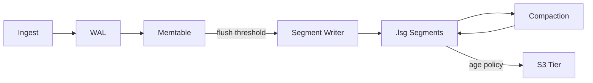
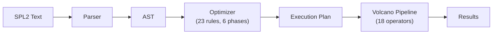

# Architecture Overview

LynxDB is a columnar log analytics database written from scratch in Go. Every component -- the storage engine, query engine, indexing layer, and HTTP API -- is purpose-built for log search and aggregation workloads. There are no embedded third-party databases (no RocksDB, no SQLite, no Lucene). This page provides a high-level map of the system and explains how the pieces fit together.

## System Diagram

```
                          ┌─────────────────────────────┐
                          │         lynxdb CLI          │
                          │  query · ingest · server    │
                          │  status · mv · config       │
                          └──────────────┬──────────────┘
                                         │
                ┌────────────────────────┼────────────────────────┐
                │                        │                        │
         ┌──────┴──────┐         ┌───────┴──────┐        ┌───────┴──────┐
         │  Pipe Mode  │         │  Server Mode │        │ Cluster Mode │
         │ (ephemeral  │         │ (persistent  │        │ (distributed │
         │  in-memory) │         │  single-node)│        │  multi-node) │
         └─────────────┘         └──────┬───────┘        └──────┬───────┘
                                        │                       │
            ┌───────────────────────────┼───────────────────────┘
            │
┌───────────┴───────────────────────────────────────────────┐
│                    Storage Engine                          │
│                                                           │
│  ┌─────────┐  ┌──────────┐  ┌───────────┐  ┌──────────┐ │
│  │   WAL   │→ │ Memtable │→ │  Segment  │→ │  S3 Tier │ │
│  │ (append │  │ (sharded │  │  Writer   │  │  (warm/  │ │
│  │  only)  │  │  btree)  │  │  (.lsg)   │  │   cold)  │ │
│  └─────────┘  └──────────┘  └─────┬─────┘  └──────────┘ │
│                                   │                       │
│  ┌────────────────────────────────┤                       │
│  │           Indexes              │                       │
│  │  ┌────────┐  ┌──────────────┐  │  ┌─────────────────┐ │
│  │  │ Bloom  │  │  Inverted    │  │  │   Compaction    │ │
│  │  │ Filter │  │  Index (FST  │  │  │  L0 → L1 → L2  │ │
│  │  │        │  │  + roaring)  │  │  │                 │ │
│  │  └────────┘  └──────────────┘  │  └─────────────────┘ │
│  └────────────────────────────────┘                       │
└───────────────────────────────────────────────────────────┘
            │
┌───────────┴───────────────────────────────────────────────┐
│                    Query Engine                            │
│                                                           │
│  ┌─────────┐  ┌───────────┐  ┌──────────┐  ┌──────────┐ │
│  │  SPL2   │→ │ Optimizer │→ │ Pipeline │→ │  Output  │ │
│  │ Parser  │  │ (23 rules)│  │ (Volcano │  │  (JSON/  │ │
│  │         │  │           │  │ iterator)│  │ table/csv│ │
│  └─────────┘  └───────────┘  └──────────┘  └──────────┘ │
│                                    │                      │
│  ┌─────────────┐  ┌───────────────┤  ┌─────────────────┐ │
│  │ Bytecode VM │  │  18 Pipeline  │  │  Segment Cache  │ │
│  │ (60+ ops,   │  │  Operators    │  │  (TTL + LRU,    │ │
│  │  0 allocs)  │  │               │  │   persistent)   │ │
│  └─────────────┘  └───────────────┘  └─────────────────┘ │
└───────────────────────────────────────────────────────────┘
```

## Three Execution Modes

LynxDB ships as a single static binary. The same binary runs in three modes depending on how you invoke it. Internally, all three modes share the same storage engine and query engine -- the difference is lifecycle and networking.

### Pipe Mode (Ephemeral, In-Memory)

```bash
cat app.log | lynxdb query '| where level="ERROR" | stats count by service'
lynxdb query --file '/var/log/nginx/*.log' '| where status>=500 | top 10 uri'
```

In pipe mode, LynxDB behaves like `grep` or `awk`. The binary:

1. Creates an ephemeral in-memory storage engine (no data directory, no WAL).
2. Ingests all data from stdin or the specified file(s).
3. Runs the full SPL2 pipeline -- parser, optimizer, Volcano iterator, bytecode VM.
4. Prints results to stdout and exits.

There is no daemon, no config file, no network I/O. The entire SPL2 engine runs locally in-process. This mode is ideal for ad-hoc debugging, scripting, and integration with Unix pipelines.

### Server Mode (Persistent, Single-Node)

```bash
lynxdb server --data-dir /var/lib/lynxdb
```

Server mode starts a long-running process that:

1. Opens (or creates) a data directory with a WAL, segment files, and metadata.
2. Replays the WAL to recover any uncommitted memtable state.
3. Starts the HTTP API on port 3100 (configurable).
4. Accepts ingest requests, buffers events in the memtable, flushes to `.lsg` segments.
5. Runs background compaction (L0 -> L1 -> L2).
6. Serves queries against both the memtable and on-disk segments.

A single server handles 50-100K events/sec on commodity hardware. Optional S3 tiering offloads older segments to object storage while keeping them queryable through a local segment cache.

### Cluster Mode (Distributed, Multi-Node)

```bash
lynxdb server --cluster.seeds node1:9400,node2:9400,node3:9400
```

Cluster mode uses the same binary with clustering flags. Nodes discover each other via seed addresses and form a cluster with three roles:

| Role | Responsibility | Scales with |
|------|----------------|-------------|
| **Meta** (3-5 nodes) | Raft consensus, shard map, node registry, leader leases, field catalog, source registry, alert assignment, view coordination | Cluster size |
| **Ingest** (N nodes) | Batcher write, memtable, segment flush, S3 upload, batcher replication | Write throughput |
| **Query** (M nodes) | Scatter-gather, partial aggregation merge, segment caching | Query concurrency |

In small clusters (< 10 nodes), every node runs all three roles. At scale, you split roles for independent scaling. The architecture is shared-storage: S3 is the source of truth for segments, making ingest and query nodes effectively stateless. Data is sharded using a two-level scheme (time bucketing + xxhash64 hash partitioning) and replicated via batcher-based replication with configurable ACK levels.

See [Distributed Architecture](/docs/architecture/distributed) for full details.

## Major Subsystems

### Storage Engine

The storage engine handles the full data lifecycle: ingest -> WAL -> memtable -> segment flush -> compaction -> tiering.



Key design choices:

- **WAL**: Append-only with configurable fsync policy (none, write, full). Batch sync every 100ms. 256 MB segment rotation. Replayed on crash recovery.
- **Memtable**: Sharded by CPU core for lock-free concurrent writes. Flushed to disk when the total size reaches 512 MB (default).
- **Segments**: Columnar `.lsg` V2 format. Per-column encoding: delta-varint for timestamps, dictionary for strings, Gorilla for floats, LZ4 for raw text. Each segment embeds a bloom filter and FST-based inverted index.
- **Compaction**: Size-tiered with three levels (L0 overlapping -> L1 merged -> L2 fully compacted at ~1 GB). Rate-limited to avoid I/O starvation.
- **Tiering**: Hot (local SSD, < 7d) -> Warm (S3, < 30d) -> Cold (Glacier, < 90d). Local segment cache for warm-tier queries.

See [Storage Engine](/docs/architecture/storage-engine) and [Segment Format](/docs/architecture/segment-format) for deep dives.

### Query Engine

The query engine transforms SPL2 text into a streaming execution pipeline:



Key components:

- **Parser**: Recursive descent parser for full SPL2. Error recovery with syntax suggestions and Splunk SPL1 compatibility hints.
- **Optimizer**: 23 rules in 6 phases -- expression simplification, predicate/projection pushdown, scan optimization, aggregation optimization, expression optimization, join optimization.
- **Pipeline**: Volcano iterator model with 18 streaming operators. Pull-based with 1024-row batches. `head 10` on 100M events reads one batch, not the entire dataset.
- **Bytecode VM**: Stack-based VM with 60+ opcodes for evaluating WHERE, EVAL, and STATS expressions. Fixed 256-slot stack. 22ns/op for a simple predicate (`status >= 500`). Zero heap allocations on the hot path.
- **Cache**: Filesystem-based segment query cache. Key = `(segment_id, CRC32, query_hash, time_range)`. TTL + LRU eviction. Persistent across restarts.

See [Query Engine](/docs/architecture/query-engine) for the full breakdown.

### Indexing

LynxDB builds two index structures per segment during flush:

- **Bloom filters**: Per-segment probabilistic index for term-level segment skipping. If a bloom filter says a term is absent, the entire segment is skipped without reading column data.
- **FST-based inverted index**: Finite State Transducer mapping terms to roaring bitmap posting lists. Supports prefix, wildcard, and fuzzy matching with sub-millisecond lookup.

Together, these indexes enable full-text search that is orders of magnitude faster than brute-force scanning. See [Indexing](/docs/architecture/indexing).

### REST API

The HTTP API layer (`pkg/api/rest`) exposes all functionality over HTTP:

- **Ingest**: JSON, NDJSON, plain text, plus compatibility endpoints for Elasticsearch `_bulk`, OTLP, and Splunk HEC.
- **Query**: Sync, async, and hybrid execution modes. NDJSON streaming for large result sets. SSE for real-time progress.
- **Management**: Fields catalog, saved queries, alerts, dashboards, materialized views, configuration.

See [REST API Overview](/docs/api/overview) for endpoint documentation.

## Data Flow

### Write Path

```
HTTP POST /api/v1/ingest
  → Parse (JSON / NDJSON / text / auto-detect)
  → Extract timestamp (_timestamp, @timestamp, time, ts, ...)
  → [Single-node mode] Append to WAL (configurable fsync)
  → [Cluster mode] Route to shard primary, replicate via batcher
  → Insert into sharded memtable
  → [When memtable >= 512 MB]
    → Flush to .lsg segment (columnar encoding + bloom + inverted index)
    → Register segment in metadata
    → [In cluster mode: upload to S3]
  → [Background]
    → Compaction merges L0 → L1 → L2
    → Tiering offloads aged segments to S3/Glacier
```

### Read Path

```
SPL2 query text
  → Parse to AST
  → Optimize (23 rules, 6 phases)
  → Build Volcano pipeline
  → Scan operator:
    → Check segment time ranges (prune by time)
    → Check bloom filters (prune by term)
    → Check inverted index (resolve full-text search)
    → Read matching columns from .lsg segments
    → Read from memtable (in-memory events)
  → Stream through pipeline operators (Filter, Eval, Aggregate, Sort, ...)
  → Bytecode VM evaluates expressions (0 allocs per row)
  → Output (JSON / table / CSV / NDJSON)
```

## Performance Characteristics

| Metric | Value |
|--------|-------|
| VM simple predicate (`status >= 500`) | 22 ns/op, 0 allocs |
| VM complex predicate (`status >= 500 AND host = "web-01"`) | 55 ns/op, 0 allocs |
| Streaming `head 10` on 100K events | 0.23 ms |
| Binary search on sorted timestamps (1M events) | 15 ns vs 232 us full scan |
| Cache hit latency | 299 ns |
| Pipeline throughput (WHERE + STATS, 100K events) | ~2.1M events/sec |
| Single-node ingest throughput | 300K+ events/sec |
| Materialized view acceleration | ~400x vs raw scan |

## Next Steps

- [Storage Engine](/docs/architecture/storage-engine) -- WAL, memtable, flush, compaction, tiering
- [Segment Format](/docs/architecture/segment-format) -- columnar `.lsg` V2 format and encoding strategies
- [Query Engine](/docs/architecture/query-engine) -- parser, optimizer, pipeline, bytecode VM
- [Indexing](/docs/architecture/indexing) -- bloom filters, FST inverted index, roaring bitmaps
- [Distributed Architecture](/docs/architecture/distributed) -- Raft, sharding, scatter-gather, S3
- [Design Decisions](/docs/architecture/design-decisions) -- why columnar, why SPL2, why Go, why single binary
